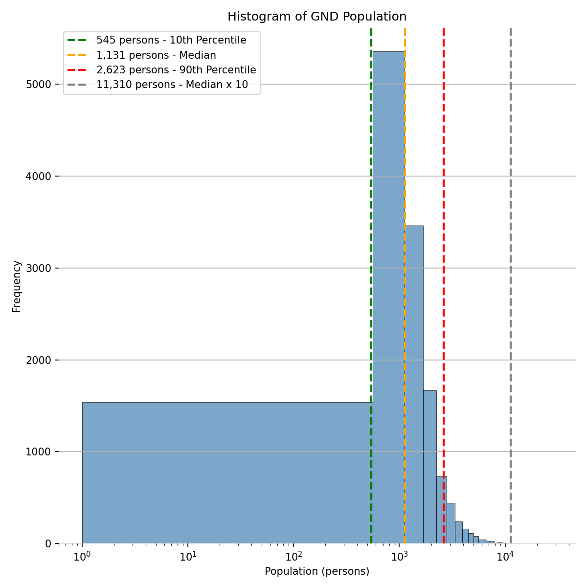
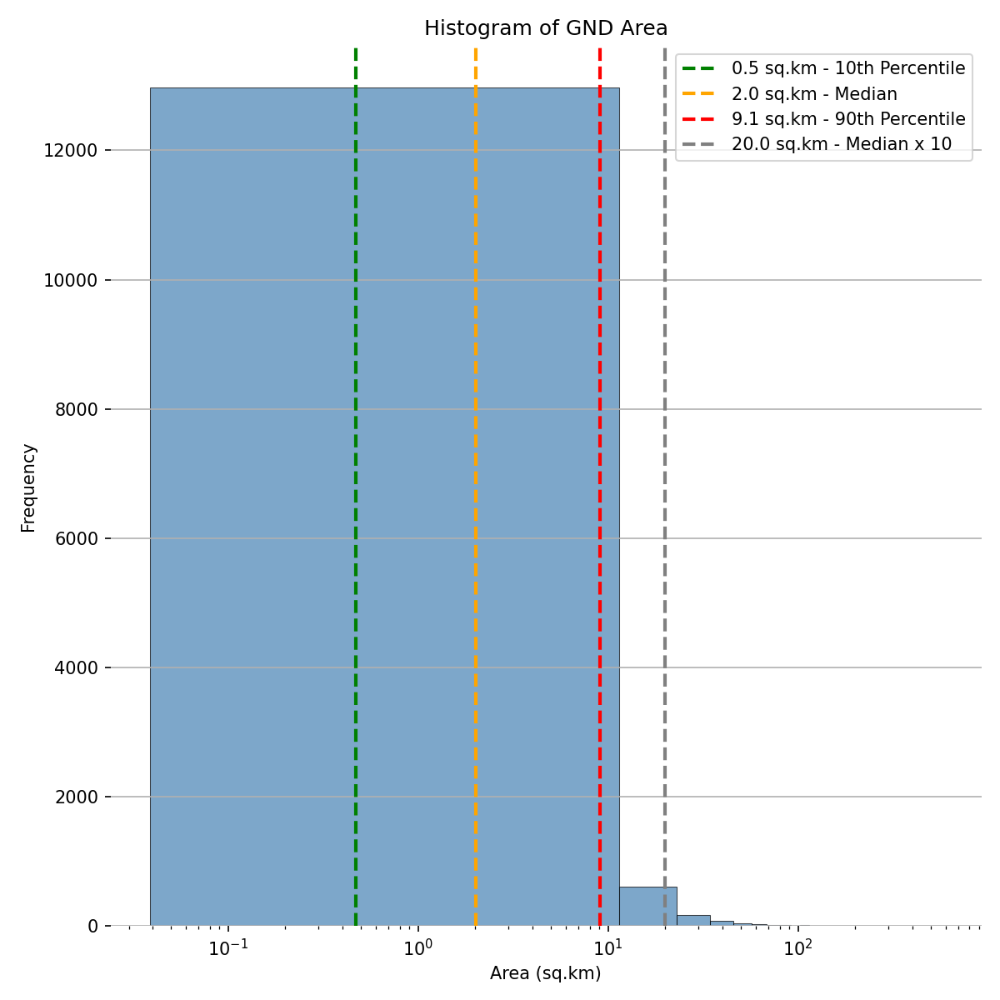
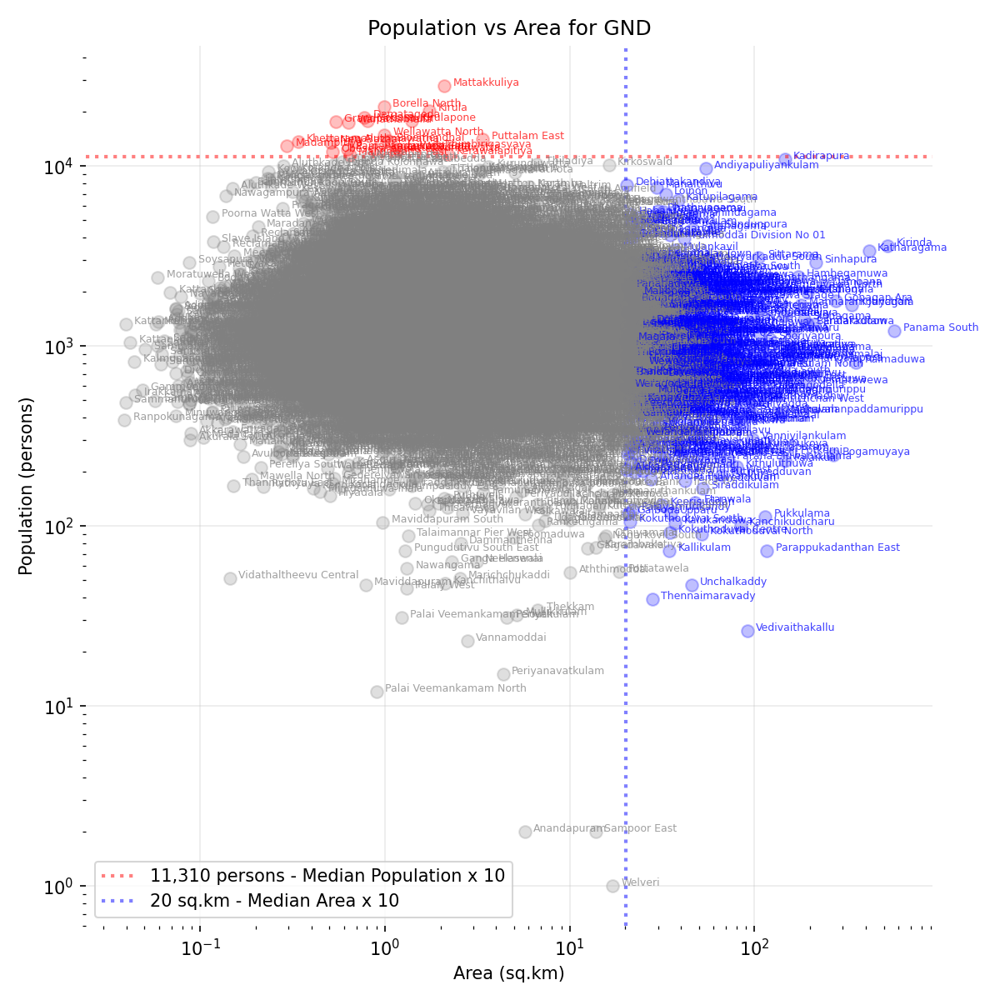

# Analysis of Population and Area of Grama Niladhari Divisions

## Background

### What is a Grama Niladhari Division (GND)?

A Grama Niladhari Division is the smallest administrative unit in Sri Lanka, forming the base of the national governance structure under a Divisional Secretariat. Each GND represents a defined community or village area and is assigned a unique official code. These divisions ensure that government administration reaches every locality, connecting the public directly to state services.

Sri Lanka's 9 provinces are divided into 25 Administrative Districts. These are, in turn, divided into 331 Divisional Secretariat Divisions (DSDs). DSDs are divided into 14,021 GNDs. GNDs are further divided into a unit known as villages. 

### Role and Importance of the Grama Niladhari

The Grama Niladhari is the government’s representative at village level, responsible for maintaining population records, issuing certificates, coordinating welfare programs, and reporting on local conditions. They assist with law and order, disaster response, and community development. This position is crucial for effective, people-centered governance, ensuring that state functions operate efficiently at the grassroots.

### Delimitation and Boundary Changes

GND boundaries are defined based on population, geography, and community identity within a Divisional Secretariat Division. The delimitation process is overseen by the Ministry of Public Administration and the Department of Census and Statistics, with changes legally formalized through Government Gazette notifications. Boundaries may be redrawn when populations grow, new settlements emerge, or administrative efficiency demands adjustments.

### Importance of Balanced Area and Population

A GND must be of a manageable size so that one Grama Niladhari can effectively serve all residents. If an area is too large, services become less accessible and administration less responsive. Similarly, overpopulated GNDs strain welfare distribution, data accuracy, and local coordination. Balanced boundaries ensure equitable representation, efficient data collection, and fair allocation of resources.

## Population of GNDs

The median population of Sri Lanka's 14,021 GNDs, as of the [2012 census](http://www.statistics.gov.lk/Resource/en/Population/CPH_2011/CPH_2012_5Per_Rpt.pdf) was 1,131 persons. 90% of GNDs had a population below 2,623. 

23 GNDs had populations greater than 10x the median (11,310 persons). The 10 largest were:

1. 28,003 persons 2.1 sq.km LK-1103010 Mattakkuliya
2. 21,326 persons 1.0 sq.km LK-1127040 Borella North
3. 20,237 persons 1.7 sq.km LK-1127075 Kirula
4. 18,602 persons 0.8 sq.km LK-1127030 Dematagoda
5. 17,846 persons 1.4 sq.km LK-1127080 Kirulapone
6. 17,757 persons 0.8 sq.km LK-1103015 Modara
7. 17,588 persons 0.5 sq.km LK-1103075 Grandpass South
8. 17,355 persons 0.6 sq.km LK-1127035 Wanathamulla
9. 14,876 persons 1.0 sq.km LK-1127085 Wellawatta North
10. 14,017 persons 3.4 sq.km LK-6215040 Puttalam East

All of these are in densely populated urban area, 9 of which are in the Colombo Municipal Council.

## Area of GNDs 

The median area of Sri Lanka's GND was 2.0 sq.km (2012 census). 90% of GNDs had a area below 9.1 sq.km. 

10 GNDs had populations greater than 10x the median (11,310 persons). The 10 largest were:

1. 1,209 persons 570.7 sq.km LK-5251060 Panama South
2. 3,614 persons 526.5 sq.km LK-3309010 Kirinda
3. 3,364 persons 415.9 sq.km LK-8227010 Katharagama
4. 805 persons 352.8 sq.km LK-6206010 Ralmaduwa
5. 1,690 persons 334.2 sq.km LK-8212240 Kotiyagala
6. 1,788 persons 274.5 sq.km LK-8224140 Gonagan Ara
7. 247 persons 268.1 sq.km LK-5209005 Bogamuyaya
8. 2,179 persons 236.8 sq.km LK-8103100 Dambana
9. 2,900 persons 214.2 sq.km LK-7210005 Sinhapura
10. 1,326 persons 210.2 sq.km LK-5112075 Eralakkulam

Most of these eomcpoass national reserves (e.g. Wilpattu).

## Concluding Recomentations

When a GND becomes too large in area or population, it can be divided into two or more smaller divisions. This allows for better administrative coverage and more direct engagement with residents. Such adjustments are typically initiated by the Divisional Secretary and formalized through the Ministry of Public Administration to maintain effective governance at the community level.

*A Visualization of Both Population and Area of Sri Lanka's GNDs*

# Appendix: Data and Code for Visualization and Analysis

See [https://github.com/nuuuwan/gig/blob/main/example_analyses/gnd_size/README.md](https://github.com/nuuuwan/gig/blob/main/example_analyses/gnd_size/README.md)
